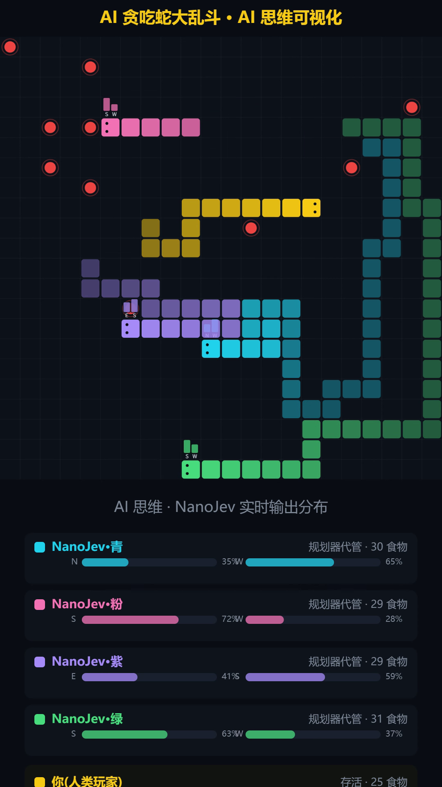

# NanoJev Arena · AI 贪吃蛇大乱斗

[](LICENSE)
[](README.md)
[](https://github.com/TianyuCodings/NanoJev)

**和 AI 打一架:你用方向键操纵金色蛇,四条 NanoJev AI 蛇同场抢食。**

模型不生成任何文字——一次前向直接输出所有候选动作的完整概率分布,蛇头上悬浮的概率条就是它"此刻的想法"。本项目是 [NanoJev](https://github.com/TianyuCodings/NanoJev)([Jev](https://typesafe.ai/blog/introducing-system-one-models-and-jev) "System One Model" 的 0.6B 开源复刻)的本地游戏演示。

<p align="center">
  
</p>

## ✨ 玩法

**贪吃蛇大乱斗(`web/snake.html`)**:1 v 4 人机对战。你和朋友——四条 NanoJev AI 蛇——同场抢食;撞墙撞身即死,尸体化作食物,记分板实时排名,右侧面板实时展示每条 AI 蛇此刻的方向概率分布。

## 🎮 操作

| 按键 | 作用 |
|---|---|
| `↑ ↓ ← →` 或 `W A S D` | 控制金色蛇方向 |
| `P` | 暂停 / 继续 |
| `R` | 重新开局 |

## 📦 安装

需要:**NVIDIA 显卡(显存 ≥ 6GB)**、Python 3.10+、Git。

```bash
git clone https://github.com/caijinchun/nanojev-arena.git
cd nanojev-arena
python install.py
```

`install.py` 会自动完成:

1. 克隆上游 [NanoJev](https://github.com/TianyuCodings/NanoJev) 仓库;
2. 创建虚拟环境并安装 Python 依赖;
3. 从 HuggingFace 下载已训练 checkpoint(默认走 `hf-mirror.com` 镜像,国内可用;约 2.3 GB);
4. 把 `web/snake.html` 拷入上游 `web/` 目录。

## 🚀 启动

```bash
cd NanoJev
# Windows
.venv\Scripts\python scripts/serve_decisions.py --checkpoint-dir checkpoints/games/variants/games_gold_seed17 --web-root web --port 8766 --precision fp32
# Linux / macOS
.venv/bin/python scripts/serve_decisions.py --checkpoint-dir checkpoints/games/variants/games_gold_seed17 --web-root web --port 8766 --precision fp32
```

打开 **http://127.0.0.1:8766/snake.html** 开打。

## 🧠 工作原理:代码 + 模型混合决策

1. **代码规划器**(每帧,0 开销):排除反向 / 撞墙 / 撞身方向 → BFS 计算到最近食物的静态最短路 → 筛出 2–4 个候选动作;
2. **NanoJev 模型**(批量,4 蛇约 0.2 s):收到一个 choice 问题,一次前向输出候选的完整概率分布,取 argmax;模型响应到达前由规划器代管,所以 AI 永远不会因为"没想好"而撞墙;
3. 提问格式与上游训练数据严格一致(composed 协议),实测判别力:目标方向 97.5% 压倒性概率;整图对照下 NanoJev 吃 27 个食物存活到步数上限,原版 Qwen3-0.6B 211 步陷入死局。

## ❓ FAQ

**没有 NVIDIA 显卡能玩吗?**
推理入口要求 CUDA。无卡可以跑上游仓库的纯浏览器回放(`side-by-side.html` 等),不需要模型。

**怎么装 CUDA 版 PyTorch?**
`install.py` 默认装的可能是 CPU 版。有 NVIDIA 显卡时建议手动换装(需要代理,官方源国内直连不通):

```bash
.venv\Scripts\pip install torch==2.14.0+cu126 --index-url https://download.pytorch.org/whl/cu126
```

**Turing 架构显卡(RTX 20 系)注意**
不要用默认 `--precision bf16`,加 `--precision fp32`,否则推理极慢。

**下载 checkpoint 太慢 / 失败?**
确认能访问 `hf-mirror.com`;或在代理环境下改用官方 `HF_ENDPOINT=https://huggingface.co`。

## 🙏 致谢

- [TianyuCodings/NanoJev](https://github.com/TianyuCodings/NanoJev) —— 模型、训练管线与服务端(MIT)
- [Jev · Typesafe](https://typesafe.ai/blog/introducing-system-one-models-and-jev) —— System One Model 原始概念
- Checkpoint 权重:[C-Tianyu/NanoJev @ HuggingFace](https://huggingface.co/C-Tianyu/NanoJev)

## 📄 License

本仓库代码以 [MIT](LICENSE) 协议开源。上游 NanoJev 与 checkpoint 权重归其作者所有,同样为 MIT / 公开下载。
